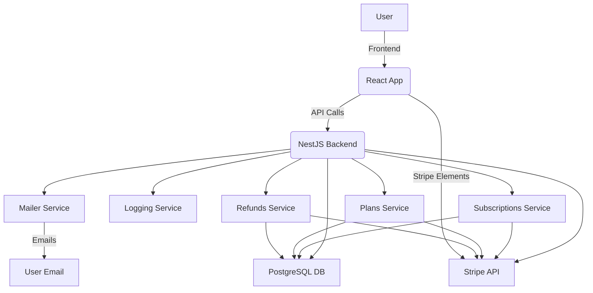

# Subscription Management System

A full-stack subscription management platform built with **NestJS** (backend) and **React** (frontend), integrated with **Stripe** for payment processing.

---

## Table of Contents

- [Features](#features)
- [Project Structure](#project-structure)
- [Flow Diagram](#flow-diagram)
- [Prerequisites](#prerequisites)
- [Environment Variables](#environment-variables)
- [Installation & Running](#installation--running)
- [Frontend (React)](#frontend-react)
- [API Endpoints](#api-endpoints)
- [Upgrade & Downgrade Logic](#upgrade--downgrade-logic)
- [Screenshots](#screenshots)
- [License](#license)

---

## Features

- User subscription management (create, upgrade, downgrade, cancel)
- Stripe integration for payments, invoices, and refunds
- Email notifications for key events (upgrade, downgrade, refund, etc.)
- Admin management of plans
- Logging and event tracking
- RESTful API with Swagger documentation
- React frontend with Stripe Elements for secure payments

---

## Project Structure

```
SubManagement/
  sub-management/
    src/
      plans/           # Plan entity, service, controller
      subscriptions/   # Subscription entity, service, controller
      stripe/          # Stripe integration logic
      refunds/         # Refund entity, service, controller
      mailer/          # Email sending logic
      logging/         # Event logging
      main.ts          # App entrypoint
      app.module.ts    # Main module
    test/              # E2E tests
    package.json       # Backend dependencies & scripts
    README.md
    ...
  frontend/
    src/               # React app source
    public/
    package.json       # Frontend dependencies & scripts
```

---

## Flow Diagram



---

## Prerequisites

- Node.js (v18+ recommended)
- npm (v9+)
- PostgreSQL database
- Stripe account (for API keys)
- (Optional) Mail server credentials for email notifications

---

## Environment Variables

Create a `.env` file in `sub-management/` with the following:

```
# Database
DB_HOST=localhost
DB_PORT=5432
DB_USER=your_db_user
DB_PASS=your_db_password
DB_NAME=your_db_name

# Stripe
STRIPE_SECRET_KEY=sk_test_...
STRIPE_WEBHOOK_SECRET=whsec_...

# Mailer (example for Gmail SMTP)
MAIL_HOST=smtp.gmail.com
MAIL_PORT=465
MAIL_USER=your_email@gmail.com
MAIL_PASS=your_email_password
```

---

## Installation & Running

### Backend (NestJS)

```bash
cd sub-management
npm install
npm run start:dev
```

- Swagger API docs: [http://localhost:3000/api/docs](http://localhost:3000/api/docs)

### Frontend (React)

```bash
cd sub-management/frontend
npm install
npm start
```

- App runs at [http://localhost:3000](http://localhost:3000)

---

## Upgrade & Downgrade Logic

### Upgrade (Immediate, Prorated)

- User can upgrade to a higher-priced plan at any time.
- The system updates the Stripe subscription immediately.
- Only the prorated difference for the remainder of the billing period is charged.
- The proration invoice is finalized and paid automatically.
- User receives an email with the invoice PDF attached.

### Downgrade (Scheduled)

- User can schedule a downgrade to a lower-priced plan.
- The downgrade is scheduled for the next billing cycle using Stripe's Subscription Schedules.
- The current plan remains active until the end of the period, then switches to the new plan.
- User receives an email notification about the scheduled downgrade.

### Cancellation & Refunds

- User can cancel at any time.
- If canceled early, a prorated refund is calculated based on unused days.
- Refund is processed via Stripe and user is notified by email.

---

## API Endpoints

- `POST /plans` - Create a new plan
- `GET /plans` - List all plans
- `POST /subscriptions` - Create a new subscription
- `PATCH /subscriptions/:id/upgrade` - Upgrade subscription
- `PATCH /subscriptions/:id/downgrade` - Schedule downgrade
- `DELETE /subscriptions/:id` - Cancel subscription
- `GET /subscriptions/:id` - Get subscription details
- `POST /stripe/webhook` - Stripe webhook endpoint
- `POST /refunds` - Create a refund
- `GET /refunds` - List all refunds

> See [http://localhost:3000/api/docs](http://localhost:3000/api/docs) for full Swagger documentation.

---

## Frontend (React)

- Built with React and Stripe Elements for secure card entry.
- Users can:
  - View available plans
  - Subscribe, upgrade, downgrade, or cancel
  - Enter payment details securely via Stripe
  - See subscription status and invoices

**To run:**

```bash
cd sub-management/frontend
npm install
npm start
```

---

## Screenshots


---

## License

This project is for educational/demo purposes. See LICENSE file for details.
